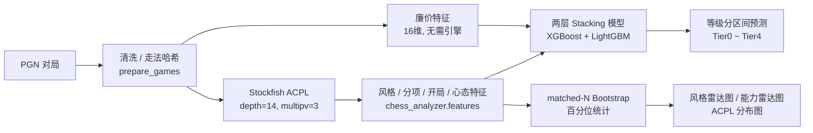

# Chess Analyzer

用 AI 量化棋手风格、评估分项能力、预测等级分区间的 Python 工具。

给定一份 PGN（或已抓取好的对局库），Chess Analyzer 会跑 Stockfish 逐步分析，
提取风格（弃子、兵风暴、重子侵入）、分项能力（开局/中局/残局 ACPL）、
心态体力（逆转率、遇强弱手偏差、疲劳效应）、开局偏好四类特征，
再用两层堆叠模型（XGBoost + LightGBM）预测该棋手所处的等级分区间。

> ⚠️ 本仓库是从个人科研原型代码重构而来的**工程化版本**，聚焦项目结构、
> 配置管理和可用性；核心算法（Stockfish 交互、双层 Bootstrap 统计、
> 两阶段 Stacking 模型逻辑）保留原作者实现，未做任何计算口径改动。
> `examples/sample.pgn` 中的对局为**模拟数据**，仅用于跑通演示流程。

## 数据来源与版权声明

本仓库 twic_sample/ 目录下包含的 PGN 数据样本来源于 The Week in Chess（TWIC），由 Mark Crowther 创办并维护。

TWIC 杂志及其提供的 PGN 棋谱文件供个人非商业用途免费使用，所有权利归原作者所有。

本仓库中的 TWIC 数据仅作为演示和测试用途的极小样本（共 X 盘对局），不构成对 TWIC 完整数据库的复制或分发。若需获取完整的 TWIC 数据，请访问 The Week in Chess 官方网站 自行下载。

> 如果你认为本仓库中的样本数据侵犯了你的权利，请联系我们，我们将及时处理。

⚠️ 本仓库及作者与 The Week in Chess 无任何关联，亦不主张对 TWIC 数据的任何所有权。

## 致谢
本项目的基线对比数据与特征工程验证，大量使用了国际象棋领域最大的开源对局数据库——Lichess。

数据来源：Lichess 开源数据库（https://database.lichess.org/）

许可证：Lichess 数据库采用 Creative Commons CC0 1.0 Universal (CC0 1.0) Public Domain Dedication（公共领域贡献）。

使用说明：我们使用 Lichess 的高等级分（1400+）对局，通过脚本提取了 Rapid（快棋）与 Classical（慢棋）的随机抽样基线，用于建立棋手风格与能力的百分位常模（Percentile Norms）。

特别感谢 Lichess 团队：作为一个非营利性开源网站，Lichess 免费向全球研究人员公开了数百万盘高水平对局数据，极大地推动了国际象棋计算机科学与数据分析的发展。本项目的基线抽样严格遵循 CC0 协议，未对原始数据作任何篡改或商业性转售。

---

## 系统架构



三条端到端流水线（`chess_analyzer.pipeline`）：

| 流水线 | 用途 |
|---|---|
| `run_feature_pipeline` | 从已抓取的 parquet 对局库批量生成四类特征表 |
| `run_inference` | 从单份 PGN 端到端预测等级分区间 |
| `run_style_report` | 生成目标棋手 vs 基线人群的可视化报告 |

## 项目结构

```
chess_analyzer/
├── pyproject.toml
├── requirements.txt
├── configs/
│   └── default.yaml          # 所有阈值 / 路径 / Bootstrap 参数
├── src/chess_analyzer/
│   ├── core/                 # 棋盘工具、颜色视角转换、配置加载
│   ├── features/             # 风格 / 分项能力 / 心态 / 开局特征提取
│   ├── pipeline/             # 三条端到端流水线（extract / predict / report）
│   ├── viz/                  # 雷达图、ACPL 分布图
│   ├── stats/                # matched-N Bootstrap 百分位统计
│   └── models/                # 模型加载、7→5 tier 概率合并
├── tests/                    # pytest 单元测试（含回归快照测试）
├── examples/
│   ├── sample.pgn            # 5 盘模拟对局（含 %clk 时间戳）
│   └── demo.ipynb            # 端到端演示 Notebook
└── README.md
```

## 快速开始

```bash
pip install -e .
```

```python
from chess_analyzer.pipeline import run_inference

result = run_inference(
    pgn_path="examples/sample.pgn",
    name="Demo Player",
    no_engine=True,   # 无 Stockfish 时先跑通流程；装好后设为 False 获得完整精度
)
print(result["final_tier"], result["avg_proba"])
```

命令行等价用法（`pyproject.toml` 已注册为 console scripts）：

```bash
chess-analyzer-predict --pgn examples/sample.pgn --name "Demo Player" --no_engine
chess-analyzer-extract     # 对应 run_feature_pipeline，读取 configs/default.yaml 的默认路径
chess-analyzer-report      # 对应 run_style_report
```

## 输出样例

`run_inference` 的典型输出（真实数值取决于安装的模型与是否启用引擎）：

```
🎯 最终判定：Tier2_2000_2399（业余精英/候选大师，约2000-2400）
   平均置信度: 0.62
   逐盘明细:
    第 1盘: Tier2_2000_2399         (0.58)
    第 2盘: Tier2_2000_2399         (0.66)
    ...
```

`run_style_report` 会在 `player_style/` 下生成：

- `{player}_style_opening.png` — 风格雷达图 + 开局偏好
- `{player}_ability_radar.png` — 开局/中局/残局能力雷达图（含 95% CI）
- `{player}_acpl_dist_*.png` — 三阶段 ACPL 分布对比图
- `{player}_percentiles.csv` — 全部特征的百分位 + 置信区间汇总表
- `style_diagnosis.txt` — 风格偏差文字诊断

## 配置

所有魔法数字、Stockfish 路径、Bootstrap 抽样次数都集中在 `configs/default.yaml`：

```yaml
stockfish:
  path: "/usr/local/bin/stockfish"   # 装好 Stockfish 后改成你的实际路径
  depth: 14
thresholds:
  opening_moves: 12
  deviation_high: 15
bootstrap:
  radar_outer: 300
  radar_inner: 100
```

不提供配置文件时，程序使用包内置的 `configs/default.yaml`（与原脚本硬编码值完全一致），
**永远不会强制要求外部配置**。也可以用环境变量覆盖任意值，例如：

```bash
export STOCKFISH_PATH=/opt/homebrew/bin/stockfish
export CHESS_ANALYZER__THRESHOLDS__OPENING_MOVES=10
```

## 依赖与安装

- Python 3.9+
- [Stockfish](https://stockfishchess.org/download/)（可选，未安装时自动降级为「仅廉价特征」模式，准确率约 50%）
- XGBoost、LightGBM（用于两层 Stacking 推理）
- python-chess、pandas、numpy、scipy、matplotlib、pyarrow

```bash
pip install -r requirements.txt
# 或安装为可编辑包（推荐）：
pip install -e .
```

模型训练脚本（`curation.py` / `ACPL_new.py` / `train_stacked_model.py` /
`train_lgb_layer2.py`）不在本次重构范围内，需自行训练后将产出的模型文件
放入 `configs/default.yaml` 中 `inference.model_dir` 指向的目录。

## 测试

```bash
pip install -e ".[dev]"
pytest tests/ -v
```

`tests/test_features.py` 中的回归测试用例已与重构前的原始脚本逐字段比对，
确保风格 / 分项能力 / 开局分类的输出 100% 一致（见下一节）。

## 重构说明（零功能回归验证）

本次重构仅涉及**代码组织和配置管理**，未修改任何计算逻辑：

1. **项目结构**：原本的`total.py` / `extra_style.py` / `predict_player.py` 按职责拆分为
   `core/` `features/` `pipeline/` `viz/` `stats/` `models/` 六个子包；
   `predict_player.py` 原有的 `sys.path.insert` 动态导入已替换为标准包导入
   `from chess_analyzer.pipeline import run_inference`。
2. **配置集中化**：所有硬编码路径 / 阈值 / Bootstrap 参数迁移至
   `configs/default.yaml`，通过 `core/config.py` 加载，支持环境变量覆盖；
   未提供配置时的默认值与原脚本硬编码值完全相同。
3. **验证方式**：用同一份合成对局（西班牙开局 14 步）分别喂给重构前的
   `total.py` 原函数和重构后的 `chess_analyzer.features.*`，两者输出的
   字典逐字段完全一致（见 `tests/test_features.py`）。

## 说明
开局ACPL（↓）：你开局犯错的严重程度。图中百分位越高，代表你开局下得越精准。

开局偏离（↓）：你开局是否走偏了（不走理论最佳着法）。图中百分位越高，代表你越严格遵循开局原则。

轻子出动（↑）：你出马象的速度。百分位越高，代表你出子越迅速、越活跃。

中局能力（中间）：

中局ACPL（↓）：中局犯错的严重程度。百分位越高，代表中局处理越好。

中局卓越（↑）：你走出“最佳/优秀”着法的比例。百分位越高，代表临场判断越准。

中局侵入（↑）：你把车/后深入敌阵的能力。百分位越高，代表施压能力越强。

战术警觉（↑）：你能及时抓住对手失误并惩罚它的能力。百分位越高，代表越善于把握机会。

残局能力（右侧）：

残局ACPL（↓）：残局犯错程度。百分位越高，代表残局技术越好。

残局池（1/0）：进入“均势残局”（可胜可和的残局）的能力。百分位越高，代表你越能把比赛拖入复杂残局发挥优势。

残局胜率（↑）：进入残局后赢棋的比例。

过渡成功（↑）：从中局向残局过渡得有多顺利，能否带着优势或仍可守的残局进入。

入场评估（↓）：你进入残局时的局面好/坏程度。百分位越高，代表你进入残局时的局面越占优。

## 许可证

MIT License

Copyright (c) [2026] [Northen one]

Permission is hereby granted, free of charge, to any person obtaining a copy
of this software and associated documentation files (the "Software"), to deal
in the Software without restriction, including without limitation the rights
to use, copy, modify, merge, publish, distribute, sublicense, and/or sell
copies of the Software, and to permit persons to whom the Software is
furnished to do so, subject to the following conditions:

The above copyright notice and this permission notice shall be included in all
copies or substantial portions of the Software.

THE SOFTWARE IS PROVIDED "AS IS", WITHOUT WARRANTY OF ANY KIND, EXPRESS OR
IMPLIED, INCLUDING BUT NOT LIMITED TO THE WARRANTIES OF MERCHANTABILITY,
FITNESS FOR A PARTICULAR PURPOSE AND NONINFRINGEMENT. IN NO EVENT SHALL THE
AUTHORS OR COPYRIGHT HOLDERS BE LIABLE FOR ANY CLAIM, DAMAGES OR OTHER
LIABILITY, WHETHER IN AN ACTION OF CONTRACT, TORT OR OTHERWISE, ARISING FROM,
OUT OF OR IN CONNECTION WITH THE SOFTWARE OR THE USE OR OTHER DEALINGS IN THE
SOFTWARE.

Permission is hereby granted, free of charge, to any person obtaining a copy
of this software and associated documentation files (the "Software"), to deal
in the Software without restriction, including without limitation the rights
to use, copy, modify, merge, publish, distribute, sublicense, and/or sell
copies of the Software, and to permit persons to whom the Software is
furnished to do so, subject to the following conditions:

The above copyright notice and this permission notice shall be included in all
copies or substantial portions of the Software.

THE SOFTWARE IS PROVIDED "AS IS", WITHOUT WARRANTY OF ANY KIND, EXPRESS OR
IMPLIED, INCLUDING BUT NOT LIMITED TO THE WARRANTIES OF MERCHANTABILITY,
FITNESS FOR A PARTICULAR PURPOSE AND NONINFRINGEMENT. IN NO EVENT SHALL THE
AUTHORS OR COPYRIGHT HOLDERS BE LIABLE FOR ANY CLAIM, DAMAGES OR OTHER
LIABILITY, WHETHER IN AN ACTION OF CONTRACT, TORT OR OTHERWISE, ARISING FROM,
OUT OF OR IN CONNECTION WITH THE SOFTWARE OR THE USE OR OTHER DEALINGS IN THE
SOFTWARE.

## 作者

原始算法与领域知识版权归 **Northen one**所有。
